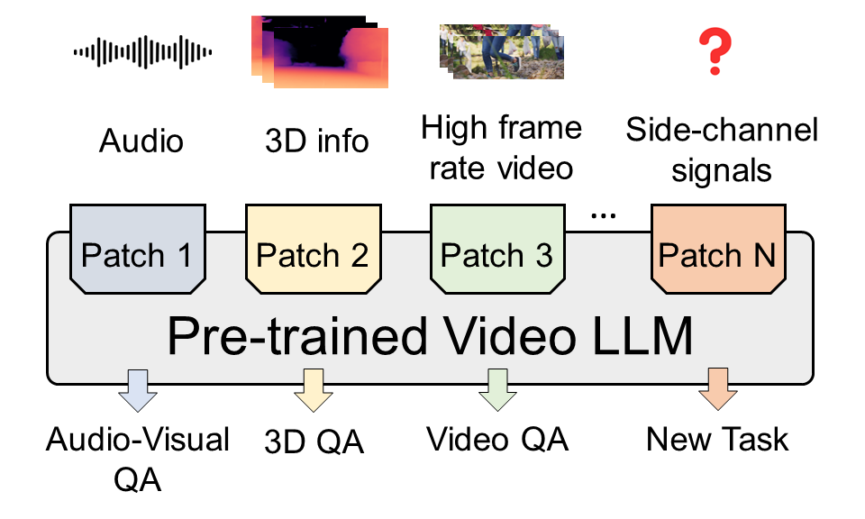
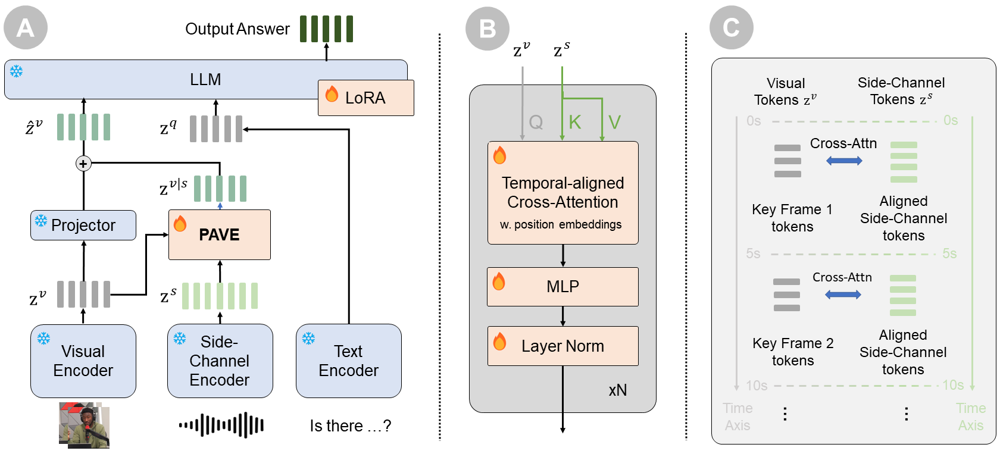
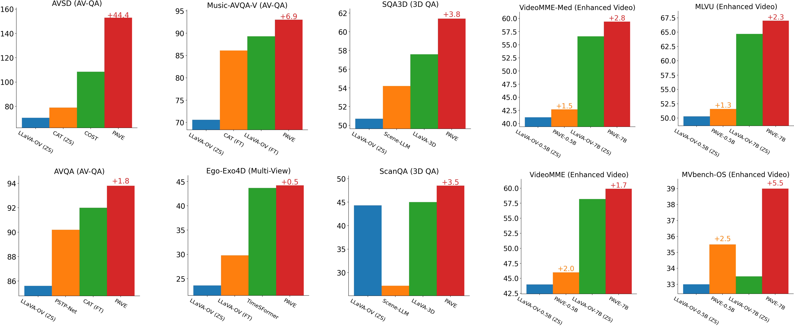
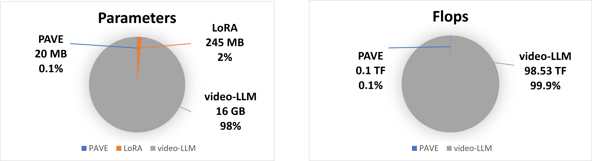

<!-- <div align="center">
  
</div>


# 🛠️ PAVE: Patching and Adapting Video Large Language Models -->


<p align="center">
  
</p>

<h1 align="center">🛠️ PAVE: Patching and Adapting Video Large Language Models</h1>

<p align="center">
  <a href="https://arxiv.org/abs/2503.19794"></a>
  <a href="https://github.com/dragonlzm/PAVE"></a>
  <a href="https://huggingface.co/papers/2503.19794"></a>
  <a href="https://huggingface.co/zhuomingliu/PAVE"></a>
  <a href="https://huggingface.co/datasets/zhuomingliu/PAVEDataset"></a>
  <!-- <a href="/LICENSE"></a> -->
</p>

<p align="center">
  <a href="https://dragonlzm.github.io/zhuomingliu.github.io/">Zhuoming Liu</a><sup>1</sup>, <a href="https://li-yiquan.github.io/">Yiquan Li</a><sup>1</sup>, <a href="https://khoiucd.github.io/">Khoi Duc Nguyen</a><sup>1</sup>, <a href="https://yiwuzhong.notion.site/Yiwu-Zhong-b5f40832583b49d793c8edc1e060221b">Yiwu Zhong</a><sup>2</sup>, <a href="https://www.biostat.wisc.edu/~yli/">Yin Li</a><sup>1</sup>
  <p align="center"><sup>1</sup>University of Wisconsin-Madison <sup>2</sup>The Chinese University of Hong Kong</p>
</p>


## Introduction
This code repo holds the implementation of PAVE, a framework that adapts pre-trained video large language model (Video-LLMs) to downstream tasks with side-channel signals, such as audio, depth information, exo-centric video and high frame rate videos. Our paper is accepted to CVPR2025 and an arXiv version of our paper is available [here](https://arxiv.org/abs/2503.19794).

<div align="center">
  
</div>

PAVE adapts video-LLMs through patching --- adding a small "patch" of additional parameters and operations to the video-LLM, without altering its existing architecture or vast pre-trained weights. Specifically, PAVE leverages cross-attention that operates between tokens derived from key video frames (as queries) and tokens from side-channel signals (as keys and values). This operation seeks to align the visual signal and side-channel signals along the time axis, fuse the signals from both sources, and then update the input visual tokens to the LLM. In doing so, PAVE allows for the input of supplementary signals, and introduces a small number of parameters and operations with a negligible computing cost, while enabling effective adaptation to various downstream tasks. 


<div align="center">
  
</div>

<div align="center">
  
</div>

Without bells and whistles, PAVE achieves state-of-the-art performance in audio-visual QA, 3DQA, multi-view video understanding by adapting video-LLM to new tasks with the cost of adding less than 1% of FLOPs and parameters.

- **Audio-visual QA:** With audio information works as side-channel information, PAVE outperforms the SOTA audio-visual model by 44 points, 2% and 7% on AVSD, AVQA and visual split of Music-AVQA, respectively.

- **3D QA:** With camera poses and scene depth are treated as side-channel signals, PAVE surpasses the previous best 3D MLLM by 2-4% on SQA3D and ScanQA.

- **Multi-view Video Understanding:** With the exo-centric video as side-channel signals, PAVE outperforms the baseline by a clear margin in Ego-Exo4D demonstrator proficiency estimation benchmark.

- **Enhanced Video Understanding:** With the densely sampled video frames as side-channel signals, PAVE improves the performance of LLaVA-OneVision with 1-5% boosts on VideoMME, MLVU and key sub-tasks of MVBench.


## Contents
- [Install](#install)
- [PAVE Weights](#pave-weights)
- [Datasets](#datasets)
- [Demo](#Demo)
- [Train](#train)
- [Evaluation](#evaluation)
- [Contact](#contact)
- [References](#references)
- [Acknowledgement](#acknowledgement)
- [License](#license)

## Install

We install this environment on Linux machine:
1. Clone the repository and navigate to PAVE folder 
```
git clone https://github.com/dragonlzm/PAVE.git
cd PAVE
```

2. Install Packages
```
conda create -n pave python=3.10 -y
conda activate pave
pip install --upgrade pip  # enable PEP 660 support
pip install -e .

pip install flash-attn==2.7.3 --no-build-isolation --no-cache-dir
pip install peft==0.10.0
pip install rotary-embedding-torch

# You may need to install following libs for evaluation
pip install mmengine, pycocotools, pycocoevalcap, pytablewriter, hf_transfer, tenacity, sqlitedict, evaluate, sacrebleu, loguru
```


## PAVE Weights
We includes all the PAVE weights for different tasks in this section. You can find all the weights from [here](https://huggingface.co/zhuomingliu/PAVE/tree/main)

### 1. Audio-Visual

| Dataset | Base Model | Schedule | Checkpoint | AVSD (CIDEr) | AVQA (Acc.) | Music-AVQA (Audio Acc.) | Music-AVQA (Visual Acc.) | Music-AVQA (Audio-Visual Acc.) | Music-AVQA (Overall Acc.) |
|----------|----------|-----------|----------- |---           |---          |---                      |---                       |---                             |---|
| AVSD | [LLaVA-OneVision-0.5B](https://huggingface.co/lmms-lab/llava-onevision-qwen2-0.5b-ov) | 1e | [pave_avsd_imagebind](https://huggingface.co/zhuomingliu/PAVE/blob/main/pave_v5_1_3_lora_avsd_imagebind.zip) | 134.5 | - | - | - | - | - |
| AVSD | [LLaVA-OneVision-7B](https://huggingface.co/lmms-lab/llava-onevision-qwen2-7b-ov)     | 1e | [pave_avsd_7B_imagebind](https://huggingface.co/zhuomingliu/PAVE/blob/main/pave_5_1_3_lora_avsd_7B_imagebind.zip) | 152.9 | - |- | - | - | - | 
| AVSD | [LLaVA-OneVision-7B](https://huggingface.co/lmms-lab/llava-onevision-qwen2-7b-ov)     | 2e with densely sampled frames | [pave_avsd_7B_imagebind_dense](https://huggingface.co/zhuomingliu/PAVE/blob/main/pave_v5_1_3_lora_avsd_audio_and_dense_7B.zip) | 160.0 | - |- | - | - | - | 
| AVQA | [LLaVA-OneVision-0.5B](https://huggingface.co/lmms-lab/llava-onevision-qwen2-0.5b-ov) | 2e | [pave_avqa_imagebind](https://huggingface.co/zhuomingliu/PAVE/blob/main/pave_v5_1_3_lora_avqa_imagebind.zip) | - | 90.4 | - | - | - | - |
| AVQA | [LLaVA-OneVision-7B](https://huggingface.co/lmms-lab/llava-onevision-qwen2-7b-ov)     | 2e | [pave_avqa_7B_imagebind](https://huggingface.co/zhuomingliu/PAVE/blob/main/pave_v5_1_3_lora_avqa_7B_imagebind.zip) | - | 93.8 | - | - | - | - |
| Music-AVQA | [LLaVA-OneVision-0.5B](https://huggingface.co/lmms-lab/llava-onevision-qwen2-0.5b-ov) | 2e | [pave_music_avqa_imagebind](https://huggingface.co/zhuomingliu/PAVE/blob/main/pave_v5_1_3_lora_music_avqa_2epoch_imagebind_3layers.zip) | - | - | 77.3 | 89.8 | 74.1 | 78.8 |
| Music-AVQA | [LLaVA-OneVision-7B](https://huggingface.co/lmms-lab/llava-onevision-qwen2-7b-ov)     | 2e | [pave_music_avqa_7B_imagebind](https://huggingface.co/zhuomingliu/PAVE/blob/main/pave_v5_1_3_lora_music_avqa7B_2epoch_imagebind_3layers.zip) | - | - | 79.7 | 93.0 | 78.0 | 82.3 |


### 2. 3D-QA

| Dataset | Base Model | Schedule | Checkpoint | ScanQA (C) | ScanQA (B-4) | ScanQA (M) | ScanQA (R) | ScanQA (EM@1) | SQA3D (EM@1)
|----------|----------|-----------|-----------|---|---|---|---|---|---|
| ScanQA | [LLaVA-OneVision-0.5B](https://huggingface.co/lmms-lab/llava-onevision-qwen2-0.5b-ov) | 1e | [pave_scanqa](https://huggingface.co/zhuomingliu/PAVE/blob/main/pave_scanqa_v5_1_3_3d_lora.zip) |  84.2 | 13.1 | 17.0 | 42.1 | 23.1 (40.0) | - |
| ScanQA | [LLaVA-OneVision-7B](https://huggingface.co/lmms-lab/llava-onevision-qwen2-7b-ov)     | 1e | [pave_scanqa_7B](https://huggingface.co/zhuomingliu/PAVE/blob/main/pave_scanqa_v5_1_3_3d_lora_7B.zip) | 103.4 | 16.0 | 19.9 | 49.0 | 29.1 (48.5) | - | 
| SQA3D  | [LLaVA-OneVision-0.5B](https://huggingface.co/lmms-lab/llava-onevision-qwen2-0.5b-ov) | 2e | [pave_sqa3d](https://huggingface.co/zhuomingliu/PAVE/blob/main/pave_sqa3d_v5_1_3_3d_lora_2epochs.zip) | - | - | - | - | - | 51.1 (52.8) | 
| SQA3D  | [LLaVA-OneVision-7B](https://huggingface.co/lmms-lab/llava-onevision-qwen2-7b-ov)     | 2e | [pave_sqa3d_7B](https://huggingface.co/zhuomingliu/PAVE/blob/main/pave_sqa3d_v5_1_3_3d_lora_7B_2epoch.zip) | - | - | - | - | - | 59.0 (61.4) | 


### 3. Multi-Video Video Understanding
| Base Model | Schedule | Checkpoint | Ego-Exo4D demonstrator proficiency (Acc.) |
|----------|-----------|-----------|---|
| [LLaVA-OneVision-0.5B](https://huggingface.co/lmms-lab/llava-onevision-qwen2-0.5b-ov) | 2e | [pave_v5_1_2_egoexo_lora](https://huggingface.co/zhuomingliu/PAVE/blob/main/pave_egoexo_v5_1_3_3d_lora_2epoch.zip)       | 32.4 |
| [LLaVA-OneVision-7B](https://huggingface.co/lmms-lab/llava-onevision-qwen2-7b-ov)     | 2e | [pave_v5_1_3_egoexo_lora_7B](https://huggingface.co/zhuomingliu/PAVE/blob/main/pave_egoexo_v5_1_3_3d_lora_7B_2epoch.zip) | 44.2 |


### 4. Enhancing Video QA
| Base Model | Schedule | Checkpoint | VideoMME (Short) | VideoMME (Median) | VideoMME (Avg)  | MVBench | MLVU |
|----------|-----------|-----------|---|---|---|---|---|
| [LLaVA-OneVision-0.5B](https://huggingface.co/lmms-lab/llava-onevision-qwen2-0.5b-ov) | 1e | [pave_v5_1_2_lora](https://huggingface.co/zhuomingliu/PAVE/blob/main/pave_v5_1_2_lora.zip)| 57.8 | 42.7 | 37.4 | 46.0 | 46.6 | 51.6 |
| [LLaVA-OneVision-7B](https://huggingface.co/lmms-lab/llava-onevision-qwen2-7b-ov)     | 1e | [pave_v5_1_3_lora_7B](https://huggingface.co/zhuomingliu/PAVE/blob/main/pave_v5_1_3_lora_7B.zip) | 71.1 | 59.4 | 59.9 | 58.0 | 67.0 |


## Datasets
We include the instructions for preparing different datasets used in the PAVE training and evaluation in this section. You can find all the annotations and pre-extracted features from [here](https://huggingface.co/datasets/zhuomingliu/PAVEDataset/tree/main). You can find the videos needed for train or eval from [here](https://huggingface.co/datasets/zhuomingliu/PAVE_others/tree/main)


### 1. AVSD
Please refer to [AVSD_Prepare](./doc/avsd_dataset_prep.md) for more information.

### 2. AVQA
Please refer to [AVQA_Prepare](./doc/avqa_dataset_prep.md) for more information.

### 3. Music-AVQA
Please refer to [Music-AVQA_Prepare](./doc/music_avqa_dataset_prep.md) for more information.

### 4. ScanQA
Please refer to [ScanQA_Prepare](./doc/scanqa_dataset_prep.md) for more information.

### 5. SQA3D
Please refer to [SQA3D_Prepare](./doc/sqa3d_dataset_prep.md) for more information.

### 6. Ego-Exo4D demonstrator proficiency
Please refer to [Ego-Exo4d-dp_Prepare](./doc/egoexo4d_dp_data_prep.md) for more information.

### 7. LLaVA-Video
Please refer to [LLaVA-Video_Prepare](./doc/llava_video_dataset_prep.md) for more information.

## Demo
We provide demo of PAVE [here](./demo_pave.py), you can also find the sample data [here](https://huggingface.co/datasets/zhuomingliu/PAVEDataset/blob/main/demo_samples.zip).

The gradio is coming soon.

## Train
We provide the sample training scripts in this section.

### 1. AVSD
Please refer to [AVSD_Train](./scripts/avsd_train.sh) for more information.

### 2. AVQA
Please refer to [AVQA_Train](./scripts/avqa_train.sh) for more information.

### 3. Music-AVQA
Please refer to [Music-AVQA_Train](./scripts/music_avqa_train.sh) for more information.

### 4. ScanQA
Please refer to [ScanQA_Train](./scripts/scanqa_train.sh) for more information.

### 5. SQA3D
Please refer to [SQA3D_Train](./scripts/sqa3d_train.sh) for more information.

### 6. Ego-Exo4D demonstrator proficiency
Please refer to [Ego-Exo4d-dp_Train](./scripts/egoexo4d_dp_data_train.sh) for more information.

### 7. Enhanced Video
Please refer to [Enhanced_video_Train](./scripts/enhanced_video_train.sh) for more information.

### 8. Multiple Side-Channels
Please refer to [Multiple_side_channels_Train](./scripts/multiple_side_channels_train.sh) for more information.

## Evaluation
We provide the sample evaluation scripts in this section.

### 1. AVSD
Please refer to [AVSD_Eval](./scripts/avsd_eval.sh) for more information.

### 2. AVQA
Please refer to [AVQA_Eval](./scripts/avqa_eval.sh) for more information.

### 3. Music-AVQA
Please refer to [Music-AVQA_Eval](./scripts/music_avqa_eval.sh) for more information.

### 4. ScanQA
Please refer to [ScanQA_Eval](./scripts/scanqa_eval.sh) for more information.

### 5. SQA3D
Please refer to [SQA3D_Eval](./scripts/sqa3d_eval.sh) for more information.

### 6. Music-AVQA
Please refer to [Ego-Exo4d-dp_Eval](./scripts/egoexo4d_dp_data_eval.sh) for more information.

### 7. Enhanced Video
Please refer to [Enhanced_video_Eval](./scripts/enhanced_video_eval.sh) for more information.

### 8. Multiple Side-Channels
Please refer to [Multiple_side_channels_Eval](./scripts/multiple_side_channels_eval.sh) for more information.

## Contact
Zhuoming Liu (zliu2346@wisc.edu)

## References
If think our work is helpful or interesting, please consider citing our paper. Thanks!
```
@misc{liu2025pavepatchingadaptingvideo,
      title={PAVE: Patching and Adapting Video Large Language Models}, 
      author={Zhuoming Liu and Yiquan Li and Khoi Duc Nguyen and Yiwu Zhong and Yin Li},
      year={2025},
      eprint={2503.19794},
      archivePrefix={arXiv},
      primaryClass={cs.CV},
      url={https://arxiv.org/abs/2503.19794}, 
}
```

## Acknowledgement

- [LLaVA-OneVision](https://github.com/LLaVA-VL/LLaVA-NeXT): the base-model that PAVE built upon, and our base model LLaVA-OneVision-7B and LLaVA-OneVision-0.5B that has the amazing video understanding capabilities!


## License
For academic use only. For commercial use, please contact the authors. 