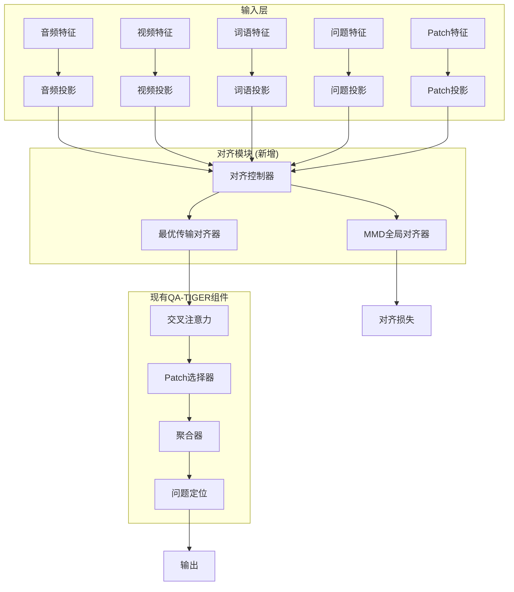

# 设计文档

## 概述

本设计文档描述了如何将AVQAAlignMamba的对齐机制（最优传输和MMD全局对齐）集成到现有的QA-TIGER模型中。集成方案采用模块化设计，确保与现有架构的兼容性，同时提供灵活的配置选项。

## 架构

### 整体架构图



### 核心设计原则

1. **非侵入性集成**: 对齐功能作为可选模块，不影响现有功能
2. **配置驱动**: 通过配置文件控制对齐策略和参数
3. **性能优化**: 最小化计算开销，支持高效推理
4. **向后兼容**: 保持与现有模型和配置的完全兼容性

## 组件和接口

### 1. 对齐控制器 (AlignmentController)

对齐控制器是集成的核心组件，负责协调对齐过程和与现有组件的交互。

```python
class AlignmentController(nn.Module):
    """
    对齐控制器：管理OT和MMD对齐的执行流程
    """
    def __init__(self, config: dict):
        # 配置参数
        self.enabled = config.get('enabled', False)
        self.strategy = config.get('strategy', 'standard')
        self.lambda_align = config.get('lambda_align', 0.1)
        
        # 对齐模块
        if self.enabled:
            self.ot_aligner = OptimalTransportAlignment(
                eps=config.get('ot_eps', 1e-8)
            )
            self.mmd_aligner = MMDGlobalAlignment(
                sigma=config.get('mmd_sigma', 1.0)
            )
    
    def forward(self, audio, video, words, quest, patch):
        if not self.enabled:
            return audio, video, words, quest, patch, 0.0
        
        # 执行对齐逻辑
        aligned_features, alignment_loss = self._perform_alignment(
            audio, video, words, quest, patch
        )
        
        return *aligned_features, alignment_loss
```

### 2. 集成到QA-TIGER的修改点

#### 2.1 构造函数修改

```python
class QA_TIGER(nn.Module):
    def __init__(self, 
                 # 现有参数...
                 use_alignment: bool = False,
                 alignment_config: dict = None,
                 **kwargs):
        super().__init__()
        
        # 现有初始化代码...
        
        # 对齐模块初始化
        self.use_alignment = use_alignment
        if use_alignment:
            alignment_config = alignment_config or {}
            self.alignment_controller = AlignmentController(alignment_config)
        else:
            self.alignment_controller = None
```

#### 2.2 前向传播修改

在现有的前向传播流程中插入对齐步骤：

```python
def forward(self, reshaped_data: Dict[str, Tensor]):
    # 现有的特征提取和投影代码...
    audio = self.audio_proj(audio)
    video = self.video_proj(video)
    words = self.words_proj(words)
    quest = self.quest_proj(quest)
    patch = self.patch_proj(patch)
    
    # VideoMamba增强处理（如果启用）
    if self.use_video_mamba:
        # 现有VideoMamba代码...
    
    # 对齐处理（新增）
    alignment_loss = 0.0
    if self.use_alignment:
        audio, video, words, quest, patch, alignment_loss = \
            self.alignment_controller(audio, video, words, quest, patch)
    
    # 现有的多模态交互与融合代码...
    audio, video = self.crs_attn(audio, video, words)
    # ... 其余现有代码保持不变
    
    # 返回结果时包含对齐损失
    return {
        'out': output,
        'fusion_logits': output,
        'alignment_loss': alignment_loss,
        'q_bias_logits': q_bias_logits,
        'a_bias_logits': a_bias_logits,
        'v_bias_logits': v_bias_logits
    }
```

### 3. 对齐策略实现

#### 3.1 标准对齐策略

```python
def _standard_alignment(self, audio, video, words, quest, patch):
    """
    标准对齐：以语言为锚点
    """
    # 使用words作为锚点进行对齐
    aligned_audio, _ = self.ot_aligner(audio, words)
    aligned_video, _ = self.ot_aligner(video, words)
    
    # 计算MMD损失
    alignment_loss = self.mmd_aligner(aligned_video, aligned_audio, words)
    
    return aligned_audio, aligned_video, words, quest, patch, alignment_loss
```

#### 3.2 反向对齐策略

```python
def _reverse_alignment(self, audio, video, words, quest, patch):
    """
    反向对齐：以视频为锚点，适用于视频问答任务
    """
    # 选择最长的序列作为锚点
    if video.shape[1] >= audio.shape[1]:
        anchor = video
        aligned_audio, _ = self.ot_aligner(audio, video)
        aligned_words, _ = self.ot_aligner(words, video)
        aligned_video = video
    else:
        anchor = audio
        aligned_video, _ = self.ot_aligner(video, audio)
        aligned_words, _ = self.ot_aligner(words, audio)
        aligned_audio = audio
    
    # 计算MMD损失
    alignment_loss = self.mmd_aligner(aligned_video, aligned_audio, anchor)
    
    return aligned_audio, aligned_video, aligned_words, quest, patch, alignment_loss
```

#### 3.3 双向对齐策略

```python
def _bidirectional_alignment(self, audio, video, words, quest, patch):
    """
    双向对齐：同时考虑两个方向的对齐
    """
    # 计算两个方向的对齐
    # 方向1：语言为锚点
    aligned_audio_1, _ = self.ot_aligner(audio, words)
    aligned_video_1, _ = self.ot_aligner(video, words)
    loss_1 = self.mmd_aligner(aligned_video_1, aligned_audio_1, words)
    
    # 方向2：视频为锚点
    aligned_audio_2, _ = self.ot_aligner(audio, video)
    aligned_words_2, _ = self.ot_aligner(words, video)
    loss_2 = self.mmd_aligner(video, aligned_audio_2, aligned_words_2)
    
    # 选择损失较小的方向
    if loss_1 < loss_2:
        return aligned_audio_1, aligned_video_1, words, quest, patch, loss_1
    else:
        return aligned_audio_2, video, aligned_words_2, quest, patch, loss_2
```

### 4. Patch特征对齐处理

由于patch特征具有额外的空间维度 [B, T, P, D]，需要特殊处理：

```python
def _align_patch_features(self, patch, anchor):
    """
    对齐patch特征
    """
    B, T, P, D = patch.shape
    B_a, T_a, D_a = anchor.shape
    
    # 将patch特征重塑为 [B, T*P, D] 进行对齐
    patch_reshaped = patch.view(B, T * P, D)
    
    # 执行对齐
    aligned_patch, _ = self.ot_aligner(patch_reshaped, anchor)
    
    # 重塑回原始维度，但时间维度与锚点对齐
    aligned_patch = aligned_patch.view(B, T_a, -1, D)
    
    return aligned_patch
```

## 数据模型

### 配置数据结构

```python
alignment_config = {
    'enabled': bool,                    # 是否启用对齐
    'strategy': str,                    # 对齐策略: 'standard', 'reverse', 'bidirectional'
    'lambda_align': float,              # 对齐损失权重
    'ot_eps': float,                    # OT数值稳定性参数
    'mmd_sigma': float,                 # MMD高斯核参数
    'patch_alignment': bool,            # 是否对齐patch特征
    'debug_mode': bool,                 # 是否返回调试信息
    'memory_efficient': bool,           # 是否使用内存优化模式
}
```

### 输入输出数据格式

```python
# 输入格式（与现有QA-TIGER兼容）
input_data = {
    'audio': torch.Tensor,      # [B, T_a, D_a]
    'video': torch.Tensor,      # [B, T_v, D_v]
    'words': torch.Tensor,      # [B, T_w, D_w]
    'quest': torch.Tensor,      # [B, D_q]
    'patch': torch.Tensor,      # [B, T_p, P, D_p]
}

# 输出格式（扩展现有格式）
output_data = {
    'out': torch.Tensor,                # 主要输出
    'fusion_logits': torch.Tensor,      # 融合logits
    'alignment_loss': torch.Tensor,     # 对齐损失
    'q_bias_logits': torch.Tensor,      # 问题偏置logits
    'a_bias_logits': torch.Tensor,      # 音频偏置logits
    'v_bias_logits': torch.Tensor,      # 视频偏置logits
    # 可选调试信息
    'debug_info': {
        'transport_matrices': List[torch.Tensor],
        'cost_matrices': List[torch.Tensor],
        'mmd_distances': torch.Tensor,
    }
}
```

## 错误处理

### 1. 输入验证

```python
def _validate_inputs(self, audio, video, words, quest, patch):
    """
    验证输入张量的形状和类型
    """
    # 检查维度兼容性
    if audio.dim() != 3 or video.dim() != 3 or words.dim() != 3:
        raise ValueError("音频、视频、词语特征必须是3维张量")
    
    # 检查特征维度一致性
    if not (audio.shape[-1] == video.shape[-1] == words.shape[-1]):
        raise ValueError("所有模态的特征维度必须一致")
    
    # 检查batch size一致性
    batch_sizes = [x.shape[0] for x in [audio, video, words, quest, patch]]
    if len(set(batch_sizes)) > 1:
        raise ValueError("所有输入的batch size必须一致")
```

### 2. 数值稳定性处理

```python
def _ensure_numerical_stability(self, tensor, eps=1e-8):
    """
    确保数值稳定性
    """
    # 检查NaN和Inf
    if torch.isnan(tensor).any() or torch.isinf(tensor).any():
        logger.warning("检测到NaN或Inf值，使用零张量替换")
        return torch.zeros_like(tensor)
    
    # 梯度裁剪
    if tensor.requires_grad:
        tensor = torch.clamp(tensor, -1e6, 1e6)
    
    return tensor
```

### 3. 内存管理

```python
def _memory_efficient_alignment(self, src, tgt, chunk_size=1000):
    """
    内存高效的对齐计算
    """
    B, T_src, D = src.shape
    _, T_tgt, _ = tgt.shape
    
    if T_src * T_tgt > chunk_size:
        # 分块处理大序列
        aligned_chunks = []
        for i in range(0, T_src, chunk_size // T_tgt):
            end_i = min(i + chunk_size // T_tgt, T_src)
            chunk = src[:, i:end_i, :]
            aligned_chunk, _ = self.ot_aligner(chunk, tgt)
            aligned_chunks.append(aligned_chunk)
        
        return torch.cat(aligned_chunks, dim=1)
    else:
        # 正常处理
        aligned, _ = self.ot_aligner(src, tgt)
        return aligned
```

## 测试策略

### 1. 单元测试

```python
class TestAlignmentController(unittest.TestCase):
    def test_standard_alignment(self):
        # 测试标准对齐策略
        pass
    
    def test_reverse_alignment(self):
        # 测试反向对齐策略
        pass
    
    def test_bidirectional_alignment(self):
        # 测试双向对齐策略
        pass
    
    def test_numerical_stability(self):
        # 测试数值稳定性
        pass
    
    def test_memory_efficiency(self):
        # 测试内存效率
        pass
```

### 2. 集成测试

```python
class TestQATigerWithAlignment(unittest.TestCase):
    def test_backward_compatibility(self):
        # 测试向后兼容性
        pass
    
    def test_alignment_disabled(self):
        # 测试对齐禁用时的行为
        pass
    
    def test_alignment_enabled(self):
        # 测试对齐启用时的行为
        pass
    
    def test_different_aggregators(self):
        # 测试与不同聚合器的兼容性
        pass
```

### 3. 性能测试

```python
class TestPerformance(unittest.TestCase):
    def test_inference_speed(self):
        # 测试推理速度
        pass
    
    def test_memory_usage(self):
        # 测试内存使用
        pass
    
    def test_convergence(self):
        # 测试训练收敛性
        pass
```

## 配置集成

### 配置文件扩展

在现有的配置文件中添加对齐相关配置：

```python
config = dict(
    # 现有配置...
    
    hyper_params=dict(
        # 现有参数...
        
        model=dict(
            # 现有模型参数...
            
            # 对齐配置（新增）
            use_alignment=False,
            alignment_config=dict(
                enabled=False,
                strategy='standard',  # 'standard', 'reverse', 'bidirectional'
                lambda_align=0.1,
                ot_eps=1e-8,
                mmd_sigma=1.0,
                patch_alignment=True,
                debug_mode=False,
                memory_efficient=True,
            )
        )
    )
)
```

### 配置验证

```python
def validate_alignment_config(config):
    """
    验证对齐配置的有效性
    """
    alignment_config = config.get('alignment_config', {})
    
    # 验证策略
    valid_strategies = ['standard', 'reverse', 'bidirectional']
    strategy = alignment_config.get('strategy', 'standard')
    if strategy not in valid_strategies:
        raise ValueError(f"无效的对齐策略: {strategy}")
    
    # 验证参数范围
    lambda_align = alignment_config.get('lambda_align', 0.1)
    if not 0 <= lambda_align <= 1:
        raise ValueError("lambda_align必须在[0, 1]范围内")
    
    return True
```

## 部署考虑

### 1. 模型兼容性

- 新模型与旧模型的权重兼容性
- 配置文件的向后兼容性
- API接口的一致性

### 2. 性能优化

- 推理时的计算优化
- 内存使用优化
- GPU利用率优化

### 3. 监控和调试

- 对齐质量监控
- 性能指标跟踪
- 调试信息输出

这个设计确保了对齐功能的无缝集成，同时保持了系统的灵活性和可维护性。